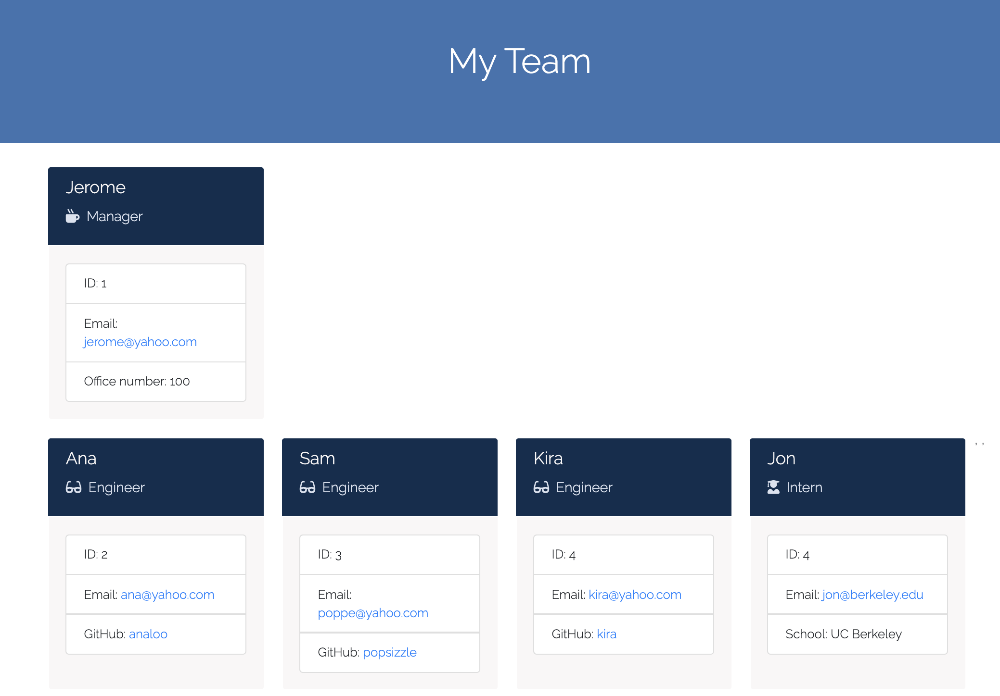

# Team Profile Generator READ ME
        
## Summary
        
This page enables managers to create team rosters by providing some information. The final output is a beautiful html file called team.html and is saved on the output folder.

 

## Site Image



## Table of Contents

- [Installation](#Installation)
- [Usage](#Usage)
- [License](#License)
- [Contributing](#Contributing)
- [Tests](#Tests)
- [Author](#Author)
        
        
## Installation
```
npm install inquirer
npm install fs
```
        
        
## Usage
use the package manager [npm]("https://nodejs.org/en/knowledge/getting-started/npm/what-is-npm/") to install the dependancies

## Dependencies
- inquirer
- fs
        
## Code Snippet

The most challenging part of creating this program was using the async function to ensure that the output of nextStep was available, before proceeding to the if/else if statements.
```
async function managerPrompt() {
    try {
        var selection = await nextStep();
        if (selection.add === "Add an employee") {
            createEngineer()

        }
        else if (selection.add === "Add an intern") {
            createIntern();
           
        }
        ...
```
        
## License

            
MIT
        
         
## Contributors
            
none
        
        
## Tests
```
none
```
        
        
## Author
[GitHub](https://github.com/analoo)


       
        
